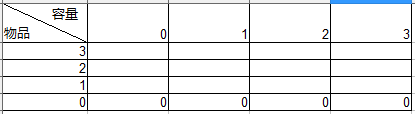
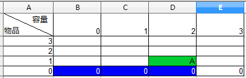
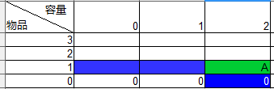

# 概念

动态规划在查找很多重叠子问题的情况的最优解时有效，可以将问题重新组合成子问题。为了避免多次解决这些子问题，结果可以缓存起来。
只能应用于有最优子结构的问题。**最优子结构的意思是局部最优解能解决全局最优解。**

经典问题有斐波那契数列与背包问题。

# 背包问题
**背包问题 (Knapsack problem)** 是一种组合优化的NP完全问题
问题。问题可以描述为：给定一组物品，每种物品都有自己的重量和价格，在限定的总重量内，我们如何选择，才能使得物品的总价格最高。问题的名称来源于如何选择最合适的物品放置于给定背包中。

如何证明背包问题是NPC问题？
首先，背包问题可以描述为决定性问题，即在总重量不超过W的前提下，总价值是否能达到V。（如果要算这个问题，必然要求出最大价值，然后和V做判断）

上述问题明显是个NP问题，接下来证明已知的NPC问题可以归约到背包问题。背包问题的本质是n个物体，每个物体都有两种状态，放或者不放，所有物品的状态最终决定了一个输出，即价值。电路问题可以归约到这个问题。所以证明成功。

## 01背包
如果限定每种物品只能选择0个或者1个，则问题称为0-1背包问题。
假设有 n 种物品，物品 j 的重量为Wj，价格为Pj，背包所能承受的最大重量为W。求能达到的最大价值。

设前 j 种物品的最大价值为 A[W, j]，那么
* A[0, W] = 0
* A[j, 0] = 0
* 如果Wj > W，A[W, j] = A[W, j - 1]
* 如果Wj <= W, A[W, j] = max(A[W, j - 1], A[W - Wj, j - 1] + Pj)

已知前 j - 1 个物品的最大价值，计算前 j 个物品的最大价值，只需要比较第 j 个物品放入与不放入的价值，取最大者就行了。

如果不放入，那价值就是A(W, j - 1)。

如果放入，为了总重量不超过W，有可能需要从前 j 个物品中拿出某些物品，但是哪什么出来我们并不知道，但是我们知道拿出以后最大价值是A(W - Wj, j - 1)，加上 Pj 就是放入j物品的价值。

为了避免重复计算子问题，可以缓存之前的计算结果。
最后需要计算的是一个 n * W 大小的表，所以整个计算的复杂度是 O(n * W)
实现方法如下：

从左下方到右上方依次填充整个表格就可以了。需要用到 n * W 大小的表。

### 空间复杂度优化
可以优化成只需要 W 大小的表。根据转移公式，A(W, j)的计算，会依赖A(W,  j - 1)和A(W - Wj, j - 1)，即只会依赖不大于 W 的项，如下表，A值只依赖蓝色区域，所以只要维护一个 W 大小的数组，从右下方开始计算，把计算的结果存在相同位置。

代码如下
<pre></code>
#include <stdio.h>
#include <malloc.h>
#include <string.h>

int need[505];
int value[505];
int best[100005];

int max(int a, int b);

int main(void)
{
    int n, m;
    while(scanf("%d %d", &n, &m) != EOF)
    {
        for (int i = 1; i <= n; i++)
            scanf("%d %d", &need[i], &value[i]);
        
        memset(best, 0, sizeof(best));
        for(int j = 1; j <= n; j++)
            for(int w = m; w >= need[j]; w--)
                best[w] = max(best[w], best[w - need[j]] + value[j]);
        printf("%d", best[m]);
    }
    return 0;
}

int max(int a, int b)
{
    return a > b ? a : b;
}
</code></pre>

## 完全背包
如果不限制每种物品选择的个数，就叫做完全背包问题。

01背包是判断第 j 个物品是否选择，完全背包是判断第 j 个物品选几个。

设前 j 种物品的最大价值为 A[W, j]，那么

* A[0, W] = 0
* A[j, 0] = 0
* 如果Wj > W，A[W, j] = A[W, j - 1]
* 如果Wj <= W, A[W, j] = max(A[W - Wj * k, j - 1] + Pj * k)       0 <= k <= W / Wj
	
由于枚举了每个物品的选择个数，所以算法复杂度为O(n * W * W / Wj) = O(n * W^2)。

### 优化方案
有下面两个等式，

<pre>
A[W, j] = max(A[W - Wj * k, j - 1] + Pj * k)                 k >= 0
A[W - Wj, j] = max(A[W - Wj - Wj * k, j - 1] + Pj * k)       k >= 0
</pre>

对于A[W, j]可以进行如下变形，

<pre>
A[W, j] = max(A[W - Wj * k, j - 1] + Pj * k)                       k >= 0 ①
        = max(A[W, j - 1], max(A[W - Wj * k, j - 1] + Pj * k))     k >= 1 ②
        = max(A[W, j - 1], max(A[W - Wj - Wj * k, j - 1] + Pj * k) + Pj) k >= 0 ③
        = max(A[W, j - 1], A[W - Wj, j] + Pj)                      k >= 0 ④
</pre>

①到②比较简单，就是把 k = 0的情况单独抽出来。

②到③属于关键步骤，比较难理解，因为 k >= 1，所以 max(A[W - Wj * k, j - 1] + Pj * k) 至少包含1个物品 j，所以可以把 j 拿出来1个，需要把W - Wj, 并把价值加上Pj，所以得到了③。

由④可以启发得到转移公式的一个思路，如果可选物体有 j 种，那个当前背包有且仅有两种状态，一种状态是没有第 j 个物体存在，对应A[W, j - 1]，另一种状态是至少有 1 个 j 物体存在，对应A[W - Wj, j] + Pj，比较这两个状态，价值大者即为 A(W, j)。

### 空间复杂度优化
同01背包一样可以优化成一维数组表示，如下图，A值只依赖蓝色区域。所以最终只需要维护一个 W 大小的数组，从左下方开始计算，把计算的结果存在相同位置。

 
代码如下

<pre></code>
#include <stdio.h>
#include <malloc.h>
#include <string.h>

int value[505];
int need[505];
int best[100005];

int max(int a, int b);

int main(void)
{
    int n, m, i, j, w;
    while(scanf("%d %d", &n, &m) != EOF)
    {
        memset(best, 0, sizeof(best));

        for(i = 1; i <= n; i++)
            scanf("%d %d", &need[i], &value[i]);

        for(j = 1; j <= n; j++)
        {
            for(w = need[j]; w <= m; w++)
                best[w] = max(best[w], best[w - need[j]] + value[j]);
        }

        printf("%d\n", best[m]);   
    }
    return 0;
}

int max(int a, int b)
{
    return a > b ? a : b;
}
</code></pre>