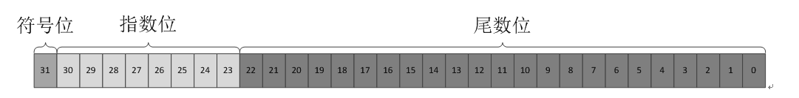

# 简介
1972年，贝尔实验室的Dennis Ritch和Ken Thompson在开发UNIX的时候发明的。两人还一起写了一本书，即著名的《The C Programming Language》，成为了第一个C标准，称为K&R  C。1989年，美国国家标准协会（ANSI），开发了一套新标准，称为 ANSI C，90年，国际化标准组织（ISO）采用了这套标准，称为ISO C，ANSI / IOS 标准的最终版本称为C89或C90。

在ANSI指定的指导标准中描述了C的精神
* 信任程序员（多年以后，他们对这条标准产生了怀疑）
* 不要妨碍程序员做需要做的事
* 保持语言精练简单
* 只提供一种方法执行一项操作
* 让程序运行的更快，即使不能保证其可移植性

之后还有两个C版本，分别是C99 和 C11。**在语法上比较大的差异是C90的变量最长长度是6（所以看某些C代码会发现变量名各种缩写），而且所有声明必须写在最前面。**

**C 标准包括 关键字、表达式、语句以及语法，如何执行 C 预处理器、C 标准库有哪些函数、以及详述这些函数的工作原理。**

C有很多编译器，最初的编译命令是cc，所以一般编译器都会用cc作为编译指令的别名。最有名编译器的GNU开发的GCC，和LLVM的Clang。在Windows下，有VS和MinGW可以用。（然而微软鼓励程序员从C转向C++和C#，虽然VS支持C89/90，但是到目前为止，它只选择性支持那些在C++新特性中能找到的C标准。）

编译器把源代码编译成中间代码，中间代码中包含代码中声明但是没有定义的函数，这些函数还没有编译，所以中间代码并不能直接执行，链接器会依照一定的路径规则寻找函数定义，编译以后与中间代码链接起来。代码要执行还需要链接启动代码，不同操作系统的启动代码会不一样。

编译器会单独编译每个源文件，然后用链接器链接起来，一般为了节省编译时间，会用gmake等工具，判断中间文件和源文件的修改日期，如果源文件修改日期早于中间文件创建日期，那么就不会编译该文件，如果源文件比较新，那么就会重新生成（rebuild）。因为这个原因有时候修改系统时间会造成源文件修改不生效的BUG（DotnetCore publish bug）。所以有时候为了保险起见，发布版本一般会把所有中间文件删除。

源代码编译后的文件会比源代码文件更大，它可以把1K的源文件创建成60K的可执行文件。因为即使很简单的C程序也需要大量机器语言来表示。

# 变量
* 存储单位，除了bit，byte，还有word，表示字。是设计计算机时给定的自然存储单位，32位机一个字是32位，64位机一个字就是64位。汇编语言里经常出现。
* **大端模式**是数据的高字节保存在内存的低地址处，低字节保存在内存的高地址中，**与我们的阅读习惯一致**，JAVA虚拟机，网络数据传输采用大端模式，因为可读性较好。
    
    **小端模式与大端相反，操作系统一般采用小端模式。**

    | 内存地址 | 小端模式存放内容 | 大端模式存放内容 |
    | - | :-: | -: |
    | 0x4000 | 0x78 | 0x12 |
    | 0x4001 | 0x56 | 0x34 |
    | 0x4002 | 0x34	| 0x56 |
    | 0x4003 | 0x12 | 0x78 |

* 命名规则，**避免使用下划线开头的变量名**。操作系统和C库经常使用一个或两个下划线开始的标识符（为了兼容性，比如新出的_Complex复数类型，因为已经有很多项目使用struct Complex的形式使用复数，为了兼容性只能用下划线开头的作为标准），应该避免在项目中使用这种名称。
* 有符号整数的表示，最简单的方案是使用1位来表示正负，表示范围是-127～+127，这样有个缺点，存在正负0，浪费了1个位组合。**二进制补码**，可以避免这个问题，是当今最常用的系统。用后7位表示0～127，如果高阶位是0，则表示正数，如果高阶位为1，表示负数，负数的值为 100000000（256的二进制）减去位组合作为无符号整数表示的值。比如11111111，高阶位为1，所以是负数，作为无符号整数是255，256-255=1，所以该位组合表示 -1。要得到二进制补码的相反数，最简单的方法是反转每一位，然后加 1。
* 二进制小数的表示，在二进制小数中，使用2的幂作为分母，例如 0.101表示为 1/2 + 0/4 + 1/8，即0.625。许多分数都不能用十进制表示，如1/3，与此类似许多分数也不能用二进制表示。**二进制只能表示多个二进制幂的和**。
* 浮点数与整数都是一个字长，但是浮点数的表示范围却别整数大，因为浮点数采用科学计数法，**范围大，但是精度低**。浮点精度只能达到6到7位。例如，整数可以表示 123456789，浮点数只能表示到123456700。

    下面详细介绍浮点数的存储结构，如下图，用1位表示符号，8位表示指数位，23位表示尾数位。
    
    

    指数也有负数，所以规定指数为 指数位数值 - 127，所以指数范围是[-127,128]，其中128表示无穷大（如果发生上溢，浮点就会变成无穷大）。
	尾数默认整数部分是1，尾数的23位全表示小数位，所以尾数的范围是 [1, 2)，这样就得出了浮点的最大表示范围是 (-2 * 2^127, 2 * 2^127) = (-3.40E+38 ~ +3.40E+38)。
	
	例如，
	1 = 1.0 * 2 ^ 0,  符号位为 0 表示正数。尾数为1.0，省略整数1，尾数位为0。指数为0, 根据上述换算规则指数位为 0+127 = 01111111，最终表示为00111111100000000000000000000000，
	-8.25 = 1000.01 = -1.00001 * 2^3（二进制乘法，小数点后移3位），符号位为 1 表示负数，尾数为1.00001，省略整数1，尾数位为00001。指数位为：3+127 = 130 =10000010。最终表示为11000001000001000000000000000000。
	
	浮点数如果上溢会让指数位为128，代表无穷大，printf() 显示该值为infinity。如果下溢，因为指数位已经无法增加了，会牺牲尾数位的精度来得到一个更小的数，比如1.11111111，除以2就变成1.01111111，牺牲了最后一位，如果一直除下去，尾数位会全变成 0 。 C库有提供用于检测下移的函数。
* 如果浮点数乘以 2 的幂，那么只要改变指数部分，如果不是2的幂，那要改变小数部分，如有必要，也会改变指数部分。
* C语言里规定char类型大小为1字节，在有些系统中char可能占据16bit，这时如果double为64bit，sizeof会显示 double 为 4 字节。
* 类型转换，在表达式运算和函数参数传递中，**如果两种数据类型不一致，会把短数据类型自动转换成长数据类型在参与运算，如果遇到有符号与无符号数，会把有符号转成无符号再参与运算（书里没说，在GCC中试出来的）**。短数据类型转换成长数据一般不会有问题，长数据转换成短数据遵循下列规则：
    * 长数据转换成短数据，会直接进行低位截断。
    * 数据长度相同的有符号转无符号，会直接忽略符号位，比如 unsigned char -1 内存表示为 11111111 转成short，值是255，内存中的值也是11111111
	* 数据长度相同的无符号转有符号，会把符号位作为有符号数的最高位，比如unsigned short 65535，内存中表示为1111111111111111，转换为 short 是-1，在内存中表示也是1111111111111111。
	* 如果数据长度不同，会先转换成相同的，再进行有符号的无符号的转换。
* Bool 值是用英国数学家George Boole的名字命名的。他开发了用代数表示逻辑和解决逻辑问题。

# 函数
* 函数声明也叫函数原型（function prototype）。函数声明指定了函数的类型，即返回值。
* C99规定，argument是实参，parameter是形参。
* 实参会储存在栈中。
* 尾递归是最简单的递归，相当于循环，所以尾递归不推荐。
* 函数指针，函数指针类型包括返回值和形参。由于函数名是指针，所以函数指针和函数名可以互相替换。例如 pf 是 ToUpper 函数的指针，那么 pf() 等价于 ToUpper() 等价于 (*pf)()

# 输入输出
* printf 
	* %a 浮点数，16进制数，p计数法
	* %d 有符号整数
	* %c 字符
	* %e 浮点数，e计数法
	* %f  浮点数，十进制计数法
	* %g 根据值大小自动选择 %e 或者 %f
	* %i 有符号十进制整数，与%d相同
	* %o 无符号八进制数
	* %p 指针
	* %s 字符串
	* %u 无符号十进制整数
	* %x 无符号十六进制整数
	* %% 打印百分号
		
* 有时候为了在输出以后暂停程序，需要在程序末尾加1到**2个 getchar()**, 为什么是两个？因为有时候 getchar() 之前跟的是 scanf(), 用户输入完毕会按换行，scanf不会读入这个换行，而是读取到接下来的 getchar() 中，所以还需要一个 getchar() 用来暂停程序。
* printf 会把输出发送到**缓冲区**中，C标准中规定，当缓冲区满、遇到换行符或需要输入时才会把缓冲区中的数据发送到屏幕或文件，这个操作叫刷新缓冲区。手动调用 fflush() 也可以刷新缓冲区。
* scanf("%d%d")读取 55 45 输入的过程：跳过空白字符读取非空字符，如果遇到的不是数字就把字符放回输入流，不赋值，结束函数。遇到空白时就不再读取输入。输入也是有缓冲区的，当按下 Enter 才会开始程序才开始读取缓冲区中的内容，这样设计的好处是可以用退格键修改输入。也有无缓冲区的输入，比如游戏按键，必须立即响应。C标准规定输入输出都是缓冲的，最初的 K&R 标准并没有这样规定。
* **回显**的概念，回显输入意味着用户输入的字符直接显示的屏幕上，无回显输入意味着击键后对应的字符不显示。可以使用 ioctl() 指定输入类型，但该函数属于 UNIX 库，不属于C 标准。
* 不同操作系统使用的**换行符**不一样，但是C标准会统一为'\n'，所以在使用标准 I/O 包的情况下，可以使用 if(ch == '\n') 这样的表达式。
* 关于**文本文件的结束符**，UNIX是没有结束符的，在文件开头记录了文件的大小。有些操作系统会把 ctrl + z 作为结束符。C 库有两种读取文件的方式，分别是二进制读取和文本读取，文本读取的实现会做一些特殊操作，比如会把结束符忽略，转换换行符等等。但是在UNIX下，这两种读取方式的实现是一样的。因为UNIX并没有特殊的结束符（这种设计更合理）
* **重定向符号**，用 < 读取文件，用 > 输出文件，可以进行组合，比如 echo < a.txt > b.txt，这个命令可以把 a.txt 的内容输出到 b.txt，也可以使用 echo > b.txt < a.txt，命令与重定向符号的顺序无关
* puts 只显示字符串，**puts 会自动在末尾加换行，fputs 不会**。
* gets  用来读取一行输入，因为无法检测输入溢出，可被黑客用来做**注入攻击**，C11 干脆废弃来该函数，所以不推荐使用。推荐用 fgets 代替。**gets不会读入换行符，fgets 会**。读到文件尾，会返回空指针。
* 标准输入输出，stdin和stdout，可作为 fgets 和 fputs 的参数。
	
# 字符串
* 字符串数组最后一位是 /0，所以字符串数组储存的字符数比数组大小小1。
* **字符串常量**属于静态存储类别，“abcd”，这就是一个字符串常量，只会被存储一次，这整个程序生命周期内存在，char* p1 = "abcd"。char* p2 = "abcd"。这句话里 p1 和 p2 的内存地址是一样的。 char[] arr1 = "abcd"，char[] arr2 = "abcd"。这句话里 arr1 和 arr2 的地址不一样，因为用字符串数组的方式存储字符串，会把字符串常量拷贝一份，存在数组的每一个元素中，**对数组元素的修改并不会影响字符串常量。如果指针指向字符串常量，那么不允许改变指针所指的值，即 \*p1 = 'd' 是会报运行时异常的。**

# 表达式
* C可以三重赋值，比如 a = b = c = 1
* 关于负数的除法，C99之前给编译器留了一些空间，即可以趋零截断，也可以四舍五入。这符合C语言的第5号精神。C99规定**趋零截断**。
* 结合律问题，例如 a * b + c * d，C没有规定先算c * d还是先算a * b，让编译器设计者根据硬件选择更效率更高的方法，这也很符合C语言第5号精神。**对于共享同一运算对象的运算符遵守从左到右的结合律。** 例如 12 / 3 * 2，除号和乘号共享3这个运算对象，所以从左到右计算，如果从右到左，那么整数运算的结果就错误了。
* **负数的求模运算**在C99规定趋零截断之前，有很多种处理方式，自从有了这条规则以后，如果第一个运算对象是负数，那么求模的结果就为负数，如果第一个运算对象是正数，那么结果也是正数。
* 递增运算符生成的机器语言代码效率更高。不过随着编译器越来越智能，会把 x = x + 1 优化成 ++x
	
# 存储结构
* 数组，数组大小必须是常数，C99支持了可变数组，要在编译参数指定 -std=c99 才能使用。编译器并不会检测数组越界，越界的内存区域里保存的内容是不确定的，可能是其他程序使用完的数据，也有可能是当前程序的某个指令。**如果对一个越界的内存区域进行操作，可能当时并不会发生什么副作用，程序也不会报错，但是事实是已经改变了一个不期望改变的值，可能导致程序在之后的某个时间错误或者崩溃，这很严重！**
* 数组的初始化，可以采用 int a[] = { 1, 2, 3}; 的形式，也可以采用 int a[5] = { 1, 2 }，该定义会之后的3个元素初始化为 0。**多维数组的初始化， int b[][] = { {0, 1}, {2, 3} };**
* int a[5]，sizeof(a) 会得到整个数组的长度（以字节为单位）。sizeof 一个指针在64位系统下会返回8。
* C标准保证给数组分配空间的时候，指向数组后面的第一个位置的指针仍然是有效指针。
	所以可以用 while( start < start + SIZE ) start++; 这样的语句
* 编译器把数组名识别为该数组的首元素地址的别名。**数组名是个地址常量**，不允许更改，即不能 arr++。
* 指针，指针必须指明类型，这样才能进行加减运算。对于 int * a;  a = a+1; 指令会把a移动4个字节，而不是1个字节。
* 指针的求差，返回的差值单位与指针的类型相同。即int指针的求差结果，表示两个指针间隔几个int
* **不能解引用空指针**操作系统划出了一块区域来存指针，而这个区域的数据还未填充，可能是其他程序残留的数据，或者其他不确定的数据。**一个非常容易出错的地方就是 <pre><code>char \*p;
scanf("%s", p);</code></pre> 。p 是空指针，往p指向的地址写入数据是违法犯罪行为！**
* 编译器会把数组表示法转换成指针表示法，例如，编译器会把arr[1] 转换成 arr + 1，为了计算arr + 1指针需要移动几位，就需要知道指针的类型，如果是二维数组 arr[m][n]，就需要知道 n 的具体数值，所以二维数组作为形参，需要传入第二个方括号里的常量。第一个方括号表明这是个指针，其他方括号表示指针所指向数据对象的类型。
* **数组与指针的区别**
	* 在对待字符串常量上的区别。
	* 数组名是地址常量，不允许arr++。指针不是，可以arr++。
* **Segment fault 错误**，当试图访问未分配的内存时，有可能出现这个错误，但也有可能不出现。
* . 比 & 的优先级高
	
# 关键字
* 翻译单元，多个文件在编译器中可能以一个文件的形式存在，通常在源代码中会包含多个头文件，编译器处理后合并成一个文件，这叫做翻译单元。
* 作用域，块作用域（方括号之间的区域），函数作用域（仅用于 goto 语句的标签），函数原型作用域（函数原型中的行参），文件作用域（翻译单元内可见）。
* 存储期，自动存储期（进入块时存在，结束块时消失），静态存储期（在程序执行期间一直存在），线程存储期（从被声明到线程结束），动态分配存储期。
* 链接，外部链接（任何文件内都可以访问），内部链接（在本翻译单元内可访问），无链接（在块中可访问）。
* 存储类别说明符
	* static，静态存储期说明符，文件作用域的变量前面如果有 static，说明变量只在当前的翻译单元中可见，如果不带 static，就具有全局可见性。也可以作用中块作用域变量上。
	* auto，自动存储期说明符，可以省略。
	* register，声明寄存器变量。不一定会生效。
	* extern，如果使用的变量在另外一个文件中，需要在声明前加入extern。**全局变量通常会在头文件中声明，并加入extern，在源文件中定义。**如果未初始化外部变量，它们会自动初始化为 0，这规则同样适用于数组元素。
* 类型限定符
	* const 语句可以禁止修改指针指向的数据。根据const 的位置不同，含义也不同。例如 const int *p；表示p指向的内容不能修改。int * const p 表示p不能被修改为其他地址。**声明数组形参时最好使用 const。另外，不要把 const 数组名作为实参传递给非 const 形参，因为c语言标准对于此情况时未定义的**。如果在头文件中定义 const 变量，**要加上 static 关键字**。否则每一个包含该头文件的代码都会定义一个 const 变量，相当于每个源文件都有一个数据副本，如果是简单变量还好，但是如果是庞大的数组就不能视而不见了。
	* volatile
	* restrict 编译器优化关键字，表明该指针是访问对象的唯一且初始的方式。
	* _Atomic (C11)
* 函数限定符
	* inline (C99)
	* _Noreturn (C11)，调用后不返回主函数，例如 exit() 函数。 
# 内存分配
* malloc 失败会返回空指针。
* **为什么程序退出前要 free 释放内存**？有些操作系统会中程序结束时释放动态分配的内存，而有些操作系统则不会，为来保险起见使用 free 释放内存，不要依赖操作系统来清理。
* calloc 把块中所有位都设置为 0。
* 变长数组是自动存储类型。
* 使用动态内存通常比栈内存慢。

# 文件处理
* **文本模式和二进制模式**，UNIX 用同一种文件格式处理文本文件和二进制文件，并用 \n 表示换行。UNIX 目录中保存了每个文件的大小的计数，程序可以使用该计数确定是否读到文件结尾。所以UNIX 的文本模式与二进制模式实现是一致的。其他系统采用不同的方法对待文本文件，比如 MS-DOS 就采用 Ctrl + Z 字符作为文件结束符，用 \r\n 作为换行符，所以这些系统中的文本模式实现，读取文本文件时，会把换行符统一转换成 \n，去掉文件结束符。在写入文本文件时，会把 \n 转换为本地系统的换行符，并加上文件结束符。
* 默认情况下，标准输入（stdin）是系统的普通输入设备，通常为键盘；标准输出和标准错误输出是系统的普通输出设备，通常为显示屏。
* **标准输出和标准错误输出分开的原因是**，如果把标准输出重定向到文件而不是屏幕，那么发送至标准错误输出的内容仍然会发送到屏幕上。这样可以马上看到错误输出，而不是只有打开文件才能看到错误。
* FILE 文件指针并不指向文件内容，它指向一个包含文件信息的数据对象。
* **EOF**，如果 getc 读取到文件结尾时，会返回 EOF。**fclose 成功关闭会返回 0，否则会返回 EOF**。应该检查。
* **二进制保存文件的缺点是不具备可移植性**，不同的系统可能采用不同的二进制表示法，甚至同一个系统，不同编译器也可能导致不同的二进制布局。所以二进制文件不适合作为存档。

# 结构
* 声明和定义结构的过程可以合并为一个步骤，这时可以省略结构标记。例如 struct { int name; } library; 
* 初始化结构变量，可以和数组一样用花括号构造一个初始化列表来初始化。与数组的初始化类似，**静态存储期结构只能用常量初始化，自动存储期结构的初始化可以不是常量**。也可以使用**初始化器**。
* 在一些系统上，因为数据对齐的关系，**结构大小可能大于所有成员大小之和**。
* **结构按值传递**。
* **联合**，编译器会分配足够大的空间，以便它能存储联合声明中占用最大字节的类型。
* **typedef** 与#define的区别
	* typedef 受限于类型，不能用于值
	* typedef 由编译器解释，而不是预处理器。
	* 在其受限范围内，typedef 比 define 更灵活。
	    * **作用域**取决于定义 typedef 所在的位置
		* 如果 #define STRING char*，STRING a, b 会导致只有a是指针，b是char。typedef就不会存在这个问题。
	* typedef 用法
		* 用在结构上，可省略结构的标记，例如 typedef struct { double x; double y } rect 。
	* **复杂声明**
		* int * rusks[10];       // (), [] 的优先级比 * 高，所以 rusks 是一个数组，而不是指针，接下来 * 表示数组的元素都是指针
		* int (* risks) [10];     // 因为() 与 [] 优先级相同，按照结合律 * 先与 risk 结合，所以 risk 是包含10个int值的数组的指针。
		* int * oof[3][4];       // 二维整形指针数组
		* int (* uuf)[3][4];     // 二维整形数组的指针
		* int (* uof[3])[4];     // a是包含2个数组指针的数组。[] 的优先级比*高，所以a先与[]结合表示a是个数组，然后*表示数组元素是指针，接下来int[3]表示元素是包含3个int元素的数组的指针。
		* char * fump(int);   // 返回值是char指针的函数。省略了形参，所以看起来不像函数。
		* char (* frump)(int);  // 函数指针。*先与frump结合，说明frump是个指针，所以frump表示返回值是char，形参是1个int的函数指针。
		* char (* flump[3])(int);  // 函数指针数组。flump先和[]结合，说明flump是个数组，然后和 * 结合，说明元素是指针，然后再和 () 结合，说明元素是函数指针。所以flump 表示包含3个函数指针的数组。

# 位运算
* 符号
    * & 与
	* | 或
	* ～ 取反
	* ^ 异或 
* 用法
	* 掩码。flag & MASK
	* 打开位。flag | MASK
	* 关闭位。flag & ~MASK
	* 切换位（打开已关闭的位或关闭已打开的位）。flag ^ MASK
* 移位运算，<< 与 >>， 用 << 运算符左移，移出左末端的位丢失，用 0 填充空出的位。用 >> 运算符右移，移出右末端的位丢失，如果是无符号数，会用 0 填充空出的位，如果是有符号数，结果取决于机器，可能用0填充，也可能用符号位的副本填充空出的位。**所以移位运算符最好作用于无符号数**。
* **移位运算符针对 2 的幂提供快速有效的乘除法**。类似于在十进制中移动小数点来乘除10。
* 位字段，例如
	<pre><code>struct {
		unsigned int field1 : 1;
		unsigned int field2 : 2:
		unsigned int field3 : 1;
		unsigned int        : 0;
		unsigned int field4 : 1; 
	}</code></pre>
	结构占据两个 unsigned int 的大小。因为一个字段不能跨越两个 unsigned int，为了保持对齐，会在第一个unsigned int 后面留下一个洞。可以用匿名字段来手动对齐。**因为有大小端差异的存在，位字段通常不容易移植**。

# 预处理器
* #include **作用其实就是复制粘贴。通常头文件会包含一些常量和函数声明**。
* 编译的时候会把反斜杠加换行符删掉。也就是说，下面的两个**物理行**
	<pre><code>  printf("That is won"\
    deful");</code></pre>
	会被合并成一个**逻辑行**。
* 编译器用一个空格字符代替每一条注释。
    <pre><code>int/*这看起来并不像个空格*/a;</code></pre>
    将变成 int a;
* #define
    * 编译器在编译期会对所有常量表达式求值。**宏只会做替换，不会求值**。
	* **宏展开要注意运算符优先级问题**。多加括号。
	* **不要在宏中使用递增递减**。
	* **宏参数**，例如 #define PF(X) printf("%d", X)
	* 简单的需要调用很多次的函数，可以用宏定义，做成**内联函数**，可以提高性能。
	* 宏名不允许有空格。
	* #符号作为预处理运算符，可以把记号转换为字符串。用法如下，
		#define PF(X) printf(#X "is %d", X)
		PF(5) 输出为 5 is 5
		x = 5, PF(x) 输出为 x is 5
* #include 
	* 不一定要 .h 结尾，只是个约定
	* 包含一个大型头文件不一定显著增加程序大小。大部分情况下，头文件只是提供编译器生成最终代码所需要的信息，而不是添加到最终代码的材料。
	* **全局变量**定义中源文件中，声明在头文件中，并用 extern 修饰。
	* 预定义宏
		* __DATE__，预处理的日期，格式为 Mmm dd yyyy，如 Nov 23 2013
		* __FILE__，源文件名的字符串
		* __LINE__，当前行号的整形常量
		* __STDC__，设置为1时，表明实现遵循 C 标准
		* __STDC_HOSTED__，本机环境设置为1，否则为0
		* __STDC_VERSION__，支持C99标准，设置为199901L，支持C11，设置为201112L
			§ __TIME__，翻译代码的时间，格式为"hh:mm:ss" 
* 防止重复 include 某个文件，可用下面的宏
    <pre><code> #ifndef _STDIO_H
	#define _STDIO_H
	...
	#endif </code></pre>
	C 标准的头文件中一般约定用文件名作为标识符，使用大写字母，点用下划线代替，以下划线为前缀或者后缀，可能使用两条下划线。**由于标准保留用下划线作为前缀，所以在自己的代码中最好不要这样做，避免与标准头文件冲突**。
* #error 可以输出编译错误。
* C99 提供 inline 关键字作为编译优化手段，可能起作用也有可能不起作用。

# 库函数
* assert，可以用来做简单的回归测试，如果修改了代码，也能通过所有assert，那说明代码基本没问题。在包含 assert.h 的位置前面，定义宏 **#define NDEBUG**，可以禁用所有 assert。
* _Static_assert (C11)，编译时检查，可以使程序无法通过编译。比如可以检查编译器是否支持某个特性，或者检查 double 是否是两个 int 的大小。
* memcpy，memmove。**memcpy 的两个区域不能有重叠**，memmove可以。

# 数据结构抽象
* 未排序列表查询可以采用并发编程加速。

